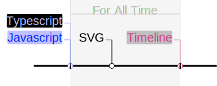

# js-timeline



Generate svg timelines with javascript. Demo: http://linkviii.github.io/js-timeline/

From json describing a list of dates, build a graphical timeline representation. 

Based on https://github.com/jasonreisman/Timeline written in python. (formated and slightly documented fork: https://github.com/Linkviii/Timeline). Almost compatible with original python implementation.


## Interface
There are 2 interface versions. v1 comes from the original python project. v2 has camelCase names (json/javascript/java style) and objects instead of tuples. v1 and v2 have the same functionality.

### Interface v1
Original project interface:

```TypeScript
type TimelineCalloutV1 = [string, string]|[string, string, string];
type TimelineEraV1 = [string, string, string]|[string, string, string, string];
interface TimelineDataV1 {
    width: number;
    fontSize?: number;
    fontFamily?: string;
    start: string;
    end: string;
    num_ticks?: number;
    tick_format?: string;
    //[[description, date, ?color],...]
    callouts?: TimelineCalloutV1[];
    //[[name, startDate, endDate, ?color],...]
    eras?: TimelineEraV1[];
}
```
See [res/simple_timeline.json](res/simple_timeline.json) for an example.

### Interface v2
New interface:

```TypeScript
interface TimelineCalloutV2 {
    description: string;
    date: string;
    color?: string;
}

interface TimelineEraV2 {
    name: string;
    startDate: string;
    endDate: string;
    color?: string;
}

export interface TimelineDataV2 {
    apiVersion: 2;
    width: number;
    fontSize?: number;
    fontFamily?: string;
    startDate: string;
    endDate: string;
    numTicks?: number;
    tickFormat?: string;
    callouts?: TimelineCalloutV2[];
    eras?: TimelineEraV2[];
}
````

**Required**: `apiVersion: 2`

See [res/animev2.json](res/animev2.json) for an example.

### Interface notes
* `colors` are hex strings.
* `width` describes the width, in pixels, of the output SVG document.  The height will be determined automatically.
* Date strings need to be in YYYY-MM-DD format. (currently parsed as `new Date(str);`)
* `start`~ is the date/time of the leftmost date/time on the axis.
* `end`~ is the date/time of the rightmost date/time on the axis.
* `num_ticks`~ controls the number of tickmarks along the axis between the `start` and `end` date/times (inclusive).  If this field is not present, no tickmarks will be generated except for those at the `start` and `end` dates.
* `tick_format`~ [strftime](https://github.com/samsonjs/strftime#supported-specifiers) date format. 
* `callouts` are events on the timeline.
* `eras` are (shaded) areas on the timeline.

## Version
* **`apiVersion`** changes in response to changes in the json's interface.
* **Library** version can be found at the top of [src/timeline.ts](src/timeline.ts). The version is (not strictly) the date that the last feature change was made. Code pushed on the `gh-pages` (master) branch should never be broken. (It's probably broken). If people use this, semantic versioning and a changelog may come. 

## Build
```Bash
npm install -g typescript
git clone https://github.com/Linkviii/js-timeline.git
# Build
tsc
```


## Dependencies 
* jquery - MIT license
* [svg.js](http://svgjs.com/): © 2012 - 2016 Wout Fierens - svg.js is released under the terms of the MIT license. 
* [strftime](https://github.com/samsonjs/strftime): Copyright 2010 - 2016 Sami Samhuri sami@samhuri.net - MIT license
  * `<script>` import
  
Based on [jasonreisman/Timeline](https://github.com/jasonreisman/Timeline) - MIT license
  
## Integration 
Some assembly required. Mostly because I can't be bothered to do more than the bare minimum when dealing with the mess that is js libs. Basically, assuming the same project structure:

```Html
<div id="timelineID"></div>
<script src="js/lib/strftime.js"></script>
```

```TypeScript
// typescript import. Compiles to
// define(["require", "exports", "./src/timeline", "./lib/svgjs"], function (require, exports, timeline_1, SVG) {
import {Timeline, TimelineData} from "./src/timeline"; 
const data:TimelineData = ...;
new Timeline(data, "timelineID").build();
```
Where
```TypeScript
type TimelineData = TimelineDataV1 | TimelineDataV2;
```

Consult the demo files: "main.ts" and "index.html". Idk how consumable it is for a random javascript application. YMMV.
  
## Why
This project exists to support my [My Anime List Timeline](https://github.com/Linkviii/js-animelist-timeline) project. As such, most timelines used for testing will be generated by it. 

## Browser Support
idk. I use firefox. Sometimes I test with chrome. I'm targeting es6 and I'm not worrying about backwards compatibility. Using the best of js is already hard enough. 

## License
MIT licensed. Please use with true freedom if you find this useful. 
